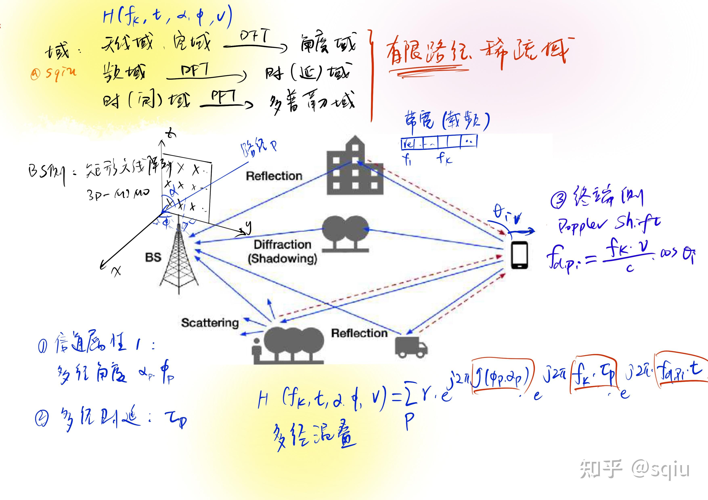

# Reading Wireless Communication Paper

## 按主题排列

### CSI Feedback

1.


2.


3.

### CSI Prediction

1.

### CSI Estimation

1.

## 按时序排列

### 2024年9月

#### 1. A Survey of Recent Advances in Optimization Methods for Wireless Communications

**Published in:** [IEEE Journal on Selected Areas in Communications](https://ieeexplore.ieee.org/xpl/RecentIssue.jsp?punumber=49) ( Early Access )

**Date of Publication:** 14 August 2024

中国科学院数学与系统科学研究院，计算数学与科学/工程计算研究所，科学与工程计算国家重点实验室

综述：通信问题的优化方案。详见[此处](./2024年9月/A_Survey_of_Recent_Advances_in_Optimization_Methods_for_Wireless_Communications.md)。

------

#### 2. SWIPT-Enabled Cell-Free Massive MIMO-NOMA Networks: A Machine Learning-Based Approach

**Published in:** [IEEE Transactions on Wireless Communications](https://ieeexplore.ieee.org/xpl/RecentIssue.jsp?punumber=7693) ( Volume: 23, [Issue: 7](https://ieeexplore.ieee.org/xpl/tocresult.jsp?isnumber=10595516&punumber=7693), July 2024)

**Date of Publication:** 01 November 2023

Ruichen Zhang, Ke Xiong 

北京交通大学计算机与信息技术学院，高速铁路网络管理技术工程研究中心，铁路交通安全协同创新中心以及先进网络技术国家工程研究中心


### 2024年10月

#### 1. AI Enlightens Wireless Communication: A Transformer Backbone for CSI Feedback

**1）基本信息**

**Published in:** China Communications

**Published Online**: Mar. 31, 2024

Xiao Han, Wang Zhiqin

标准研究部，OPPO，北京 100026，中国。With 2nd Wireless Communication Artificial Intelligence (AI) Competition (WAIC) as the background

**2）论文要点**

+ 本论文可作为CSI feedback研究的范式，介绍了多种研究办法均可尝试与使用。

+ 基于深度学习的信道状态信息（CSI）反馈也可以与传统的基于码本的机制（包括5G系统中的Type I和Type II）进行公平比较。**对特征向量先进行特征值分解再进行运算。**

$$
H_k^HH_kw_k = \lambda_k w_k
$$

对上式的理解

+ 对第二届WAIC中涉及的CSI反馈框架及其相应的信道模型进行描述。
+ 在第二届WAIC中引入了一系列增强方案，包括i) 数据增强，ii) 损失函数设计，iii) 训练策略，以及iv) 模型集成。


#### 2. Transformer-Aided Wireless Image Transmission With Channel Feedback

**1）基本信息**

**Published in:** [IEEE Transactions on Wireless Communications](https://ieeexplore.ieee.org/xpl/RecentIssue.jsp?punumber=7693) ( Volume: 23, [Issue: 9](https://ieeexplore.ieee.org/xpl/tocresult.jsp?isnumber=10678756&punumber=7693))

**Published Online**:  September 2024

Haotian Wu, Emre Ozfatura, Krystian Mikolajczyk, and Deniz Gündüz

the Department of Electrical and Electronic Engineering, Imperial College London, SW7 2AZ London, U.K

**2）论文要点**

+ Channel feedback, joint source-channel coding, vision transformer, semantic communication, image transmission.
+ 反馈辅助无线图像传输：解决了现有信道反馈图像传输方法的高复杂性、不适应性、次优性和非泛化性
  + 块反馈信道模型，其中发射器在每个块后接收无噪声/有噪声信道输出反馈。
  + 从反馈信号中获取信道状态信息和解码器对源图像的当前信念，在每个块上生成编码符号。
  + 直接通过反馈来适应信道条件，而不需要单独的信道估计。

包含CSI反馈的部分，更广义一些的，还包括信道状态信息对信道编解码的应用。——似乎和波束赋形是不一样的方向？他们各在哪些位置？


#### 3. SCAN: Semantic Communication With Adaptive Channel Feedback

**1）基本信息**

**Published in:** IEEE TRANSACTIONS ON COGNITIVE COMMUNICATIONS AND NETWORKING, VOL. 10, NO. 5, OCTOBER 2024

**Published Online**:  Manuscript received 30 September 2023

Guangyi Zhang, Yunlong Cai

 the College of Information Science and Electronic Engineering, Zhejiang University

**2）论文要点**

+ Channel feedback, semantic communication, semantic distortion outage probability (SDOP), multiple-input
  multiple-output (MIMO), wireless image transmission.

+ 预测重建质量较低的图像，将分配较长的CSI码字，以保证重建质量

#### 4. A Low-Overhead Incorporation-Extrapolation Based Few-Shot CSI Feedback Framework for Massive MIMO Systems

**1）基本信息**

**Published in:** IEEE TRANSACTIONS ON WIRELESS COMMUNICATIONS, VOL. 23, NO. 10, OCTOBER 2024

**Published Online**:  Manuscript received 6 December 2023

Binggui Zhou， Xi Yang， Guanghua Yang.

the School of Intelligent Systems Science and Engineering, Jinan University

the State Key Laboratory of Internet of Things for Smart City and the Department of Electrical and Computer Engineering, University of Macau, Macau, China

the School of Communication and Electronic Engineering, East China Normal University, Shanghai 200241, China

**2）论文要点**

+ Massive MIMO, CSI feedback, few-shot learning, domain knowledge, AIGC.

+ 通过合并-外推CSI反馈方案，UE将合并过程形成的基于低维特征向量的CSI反馈给BS， BS再通过外推过程恢复基于全维特征向量的CSI
+ 利用频域相关性对CSI数据进行增强的知识驱动数据增强方法，该方法具有较好的有效性和易于实现的特点。
+ 进一步提出了一种基于aigc的数据增强方法，利用新的EGAN架构来提高增强数据样本的多样性

**3）论文思考**

+ 如何利用AIGC的，用无线通信领域的知识就能few-shot？有点扯吧
+ 语境除了天线数的增长还有带宽的增加
+ SRNet in [10] employed the image super-resolution technology to exploit CSI frequency characteristics，Maybe U-net
+ 看到一个说码本能大幅度减小开销的说法，想来是对的，所以目前都以码本做benchmark了
+  In practice, collecting such large amounts of samples necessitates substantial CSI acquisition time and pilot training overhead [18], which is always unaffordable. 
  + 泛化性
  + 移动性

#### 5. Auto-CsiNet: Scenario-Customized Automatic Neural Network Architecture Generation for Massive MIMO CSI Feedback

**1）基本信息**

**Published in:** IEEE TRANSACTIONS ON WIRELESS COMMUNICATIONS, VOL. 23, NO. 10, OCTOBER 2024

**Published Online**:  Manuscript received 13 June 2023;

Xiangyi Li，Jiajia Guo， Chao-Kai Wen, **Shi Jin**

National Mobile Communications Research Laboratory, Southeast University,

**2）论文要点**

+ neural architecture search (NAS) to automate the generation of scenario-customized CSI feedback NN architectures.

**3）论文思考**

+ 感觉也是一个泛化性研究或者解决策略，不同的场景不同的模型

#### 6. Bayesian Hierarchical Sparse Autoencoder for Massive MIMO CSI Feedback

**1）基本信息**

**Published in:** IEEE TRANSACTIONS ON SIGNAL PROCESSING, VOL. 72, 2024

**Published Online**:  Manuscript received 4 December 2023

Huayan Guo , Member, IEEE and Vincent K. N. Lau , Fellow, IEEE

the Department of Electronic and Computer Engineering, The Hong Kong University of Science and Technology, Kowloon 999077, Hong Kong 

**2）论文要点**

+ Massive MIMO, deep learning, CSI feedback, variational autoencoder.
+ However, this AE architecture applies the same compression function to different channel realizations, which implicitly assumes that the CSI realizations are stationary. In practice, the UE may experience time-varying scattering scenarios, which may lead to a significant increase in the reconstruction error at the BS due to the mismatch between the actual and the learned CSI statistics.
+ existing AE-based schemes suffer from critical issues in both CSI dimensionality reduction and latent feature quantization.
+ 将信道统计信息封装在神经网络参数中，我们提出了一种模型辅助贝叶斯率失真训练

**3）论文思考**

+ 感觉也是一个泛化性研究或者解决策略，不同的场景不同的模型

#### 7. Concrete Feedback Layers: Variable-Length, Bit-Level CSI Feedback Optimization for FDD Wireless Communication Systems

**1）基本信息**

**Published in:** IEEE TRANSACTIONS ON WIRELESS COMMUNICATIONS, VOL. 23, NO. 10, OCTOBER 2024

**Published Online**:  Manuscript received 21 December 2023

Dong Jin Ji , Member, IEEE, and Byung Chang Chung , Member, IEEE

the Department of Semiconductor Engineering, Seoul National University of Science and Technology

**2）论文要点**

+ 促进深度学习无线通信系统中真正的位级端到端CSI反馈。利用具体分布的原理，这些层有效地解决了在位级反馈方案中传统上阻碍梯度流到UE模型的离散操作的挑战。
+ 我们未来的工作将集中于在实际通信系统中实现和测试所提出的模型。这将涉及使用软件定义的无线电组件来测量CSI矩阵，然后将所提出的模型应用于变长数字反馈。

#### 8. Deep Joint CSI Feedback and Multiuser Precoding for MIMO OFDM Systems

**1）基本信息**

**Published in:** arXiv:2404.

**Published Online**:  arXiv:2404.

Yiran Guo, Wei Chen, Jialong Xu and Bo Ai

School of Electronic and Information Engineering, Beijing Jiaotong University, Beijing, China. 

**2）论文要点**

+ 这些CSI压缩和反馈方法基于分离源信道编码（SSCC）范式，并假设了完美的反馈信道。因此，他们很容易受到“悬崖效应”的影响。也就是说，如果实际反馈信道条件低于预期，CSI的重建质量会突然下降。为了缓解“悬崖效应”，提高CSI重构质量，在源信道联合编码范式的基础上，提出了CSI反馈深度联合源信道编码（DJSCC）网络[6]。
+ 联合CSI反馈和多用户预编码方法。
+ 设计了联合多用户预编码模块和功率分配模块，根据反馈的CSI信息调整预编码方向和用户预编码功率。

**3）论文思考**

+ 反馈的输入就是SVD分解后的CSI，应该可以直接用于与编码，但它额外在UE侧再设计一个预编码的解码模块
  + 可能和多用户有关。


#### 9. Learning-Based Integrated CSI Feedback and Localization in Massive MIMO

**1）基本信息**

**Published in:** IEEE TRANSACTIONS ON WIRELESS COMMUNICATIONS, VOL. 23, NO. 10, OCTOBER 2024

**Published Online**:  Manuscript received 29 February 2024

Jiajia Guo , Member, IEEE, Yan Lv, Student Member, IEEE, Chao-Kai Wen , Fellow, IEEE, Xiao Li , Member, IEEE, and **Shi Jin** , Fellow, IEEE

National Mobile Communications Research Laboratory, Southeast University

**2）论文要点**

+ Massive MIMO, CSI feedback, localization, coarse position, deep learning.
+ 本文介绍了CSI反馈和定位的集成学习框架，旨在协同改进这两项任务。


#### 10. Toward Better Low-Rate Deep Learning-Based CSI Feedback: A Test Channel-Based Approach

**1）基本信息**

**Published in:** IEEE TRANSACTIONS ON WIRELESS COMMUNICATIONS, VOL. 23, NO. 8, AUGUST 2024

**Published Online**:  Manuscript received 29 November 2022

Xin Liang, Zhuqing Jia, and Xinyu Gu

the School of Artificial Intelligence, Beijing University of Posts and Telecommunications

**2）论文要点**

+ Massive MIMO, CSI feedback, deep learning, quantization, rate distortion theory.
+ 码字量化优化


#### 10. Design of an Efficient CSI Feedback Mechanism in Massive MIMO Systems: A Machine Learning Approach using Empirical Data


#### 11. Spectral Temporal Graph Neural Network for Massive MIMO CSI Prediction

**1）基本信息**

**Published in:** IEEE WIRELESS COMMUNICATIONS LETTERS, VOL. 13, NO. 5, MAY 2024

**Published Online**:  accepted 27 February 2024.

**Sharan Mourya** , Pavan Reddy , SaiDhiraj Amuru, and Kiran Kumar Kuchi

 the Electrical and Computer Engineering Department, University of Illinois at Urbana–Champaign, Urbana, IL, USA

**2）论文要点**

+ Graph neural networks, STEM GNN, CSI feedback, CSI prediction, STNET, massive MIMO.

+ 卷性能


#### 12. A Comparison of Neural Networks for Wireless Channel Prediction


**2）论文要点**

+ 各框架性能比较


#### 13. Accurate channel estimation and hybrid beamforming using Artificial Intelligence for massive MIMO 5G systems 

**1）基本信息**

**Published in:** International Journal of Electronics and Communications 2024

**Published Online**:  Accepted 12 October 2023 

**Sharan Mourya** ,M. Kanaka Chary, C.H. Vamshi Krishna, D. Rama Krishna

Department of Electronics and Communication Engineering, University College of Engineering, Science & Technology, JNTU Hyderabad, India 

**2）论文要点**

+ Massive Multi User-Multiple Input Multiple Output (MU-MIMO) , Artificial Intelligence (AI) Hybrid Beamforming (HB) ,Channel Estimation, 5G 
+ 信道估计和波束成形混合模型


#### 14. Channel Estimation Algorithm Based on Parrot Optimizer in 5G Communication Systems

**1）基本信息**

**Published in:** Electronics 2024, 13, 3522.

**Published Online**:  Received: 20 July 2024

Ke Sun and Jiwei Xu

School of Marine Science and Technology, Northwestern Polytechnical University, Xi’an 710072, China

**2）论文要点**

+ 卷性能


#### 15. Channel Estimation for Movable Antenna Aided Wideband Communication Systems

**1）基本信息**

**Published in:** arXiv 2409

**Published Online**:  arXiv 2409

Zhenyu Xiao, Senior Member, IEEE, Songqi Cao, Graduate Student Member, IEEE, Lipeng Zhu, Member, IEEE, Boyu Ning, Member, IEEE, Xiang-Gen Xia, Fellow, IEEE, and Rui Zhang, Fellow, IEEE

the School of Electronic and Information Engineering, Beihang University, Beijing 

**2）论文要点**

+ 宽带移动天线系统的信道估计问题。

+ 可移动天线（MA）技术，也称为流体天线系统（FAS）[12]，允许天线在特定区域内连续移动，最近被认为是一种有前途的技术，可以充分利用空间域的自由度。

#### 

#### 16. DCsiNet: Effective Handling of Noisy CSI in FDD Massive MIMO System

**1）基本信息**

**Published in:** IEEE WIRELESS COMMUNICATIONS LETTERS, VOL. 13, NO. 9, SEPTEMBER 2024

**Published Online**:  received 19 May 2024

Syed Samiul Alam, Graduate Student Member, IEEE, Arbil Chakma , Graduate Student Member, IEEE, Al Imran, and Yeong Min Jang

the Electronic Engineering Department, Kookmin University, Seoul 02707, South Korea

**2）论文要点**

+ 去噪

#### 17. Cell-Free XL-MIMO Meets Multi-Agent  Reinforcement Learning: Architectures, Challenges, and Future Directions

**1）基本信息**

**Published in:** IEEE Wireless Communications • August 2024

Zhilong Liu, Jiayi Zhang, Ziheng Liu, Hongyang Du, Zhe Wang, Dusit Niyato, Mohsen Guizani, and Bo Ai

Beijing Jiaotong University, China; 

the Nanyang Technological University, Singapore

Mohamed Bin Zayed University of Artificial Intelligence, UAE

**2）论文要点**

+ new NFC characteristics, basic system scheme, and application scenarios of cell-free XL-MIMO systems. 
+ 多智能体强化学习，用于天线选择（AS）和功率控制

#### 18. Characterizing and Utilizing Near-Field Spatial Correlation for XL-MIMO Communication

**1）基本信息**

**Published in:** IEEE Transactions on Communications

Zhenjun Dong, Xinrui Li, and **Yong Zeng**, Senior Member, IEEE

the National Mobile Communications Research Laboratory and Frontiers Science Center for Mobile Information Communication and Security, Southeast University,

**2）论文要点**

+ 超大规模多输入多输出（xml - mimo）通信的近场空间相关（SC），其中由于天线阵列的大尺寸，散射体和/或用户的位置可能处于辐射近场区域。因此，传统的远场均匀平面波（UPW）假设不再成立。
+ 考虑了通用非均匀球面波（NUSW）模型来准确表征不同天线单元上的信号幅度和相位变化。推导了近场散射体分布的新表达式，将传统的远场散射体模型推广到近场散射体分布。
+ 基于统计信道状态信息（CSI），利用所开发的近场SC获得遍历频谱效率最大化的最优传输策略。


#### 19. Deep Learning-Based CSI Feedback for XL-MIMO Systems in the Near-Field Domain

**1）基本信息**

arXiv2405

Zhangjie Peng, Ruijing Liu, Zhaotian Li, Cunhua Pan, Senior Member, IEEE, and Jiangzhou Wang, Fellow, IEEE

the College of Information, Mechanical and Electrical Engineering, Shanghai Normal University, Shanghai 200234

National Mobile Communications Research Laboratory, Southeast University, Nanjing 210096, China

the School of Engineering, University of Kent, CT2 7NT Canterbury, U.K. 

**2）论文要点**

+ Deep Learning, XL-MIMO, near-field domain, CSI feedback.

Introduction

+ 信号在近场信道中不再表现为平面波特征，而是表现为球面波特征，这使得信道状态信息（CSI）高度复杂。
+ 天线阵列规模的增大也使得CSI矩阵的尺寸显著增大。
+ 在CSI解压缩的精度方面都不令人满意，并且对XLMIMO系统近场域CSI反馈的研究还没有得到深入的研究。


#### 20. On the Downlink Average Energy Efficiency of Non-Stationary XL-MIMO

#### 21. Optimizing Near-Field XL-MIMO Communications: Advanced Feedback Framework for CSI

#### 22. Performance Analysis and Low-Complexity Design for XL-MIMO With Near-Field Spatial Non-Stationarities

XL-MIMO的信道理论推导

**1）基本信息**

 IEEE JOURNAL ON SELECTED AREAS IN COMMUNICATIONS, VOL. 42, NO. 6, JUNE 2024

Kangda Zhi , Cunhua Pan , Senior Member, IEEE, Hong Ren , Member, IEEE, Kok Keong Chai, Cheng-Xiang Wang , Fellow, IEEE， Robert Schober , Fellow, IEEE, and Xiaohu You , Fellow, IEEE

the National Mobile Communications Research Laboratory, Southeast University, Nanjing 211189, China 

**2）论文要点**

基础知识

近场效应

Fraunhofer距离（Rayleigh距离）是用来区分近场和远场的一个经典标准。它的计算公式为：
$$
d_f = \frac{2D^2}{\lambda}
$$
其中，$D$ 表示阵列的最大孔径（即天线或设备的最大尺寸），而 $\lambda$ 表示波长。

+ 阵列的**最大孔径**（Largest Array Aperture）指的是阵列天线或传感器阵列的最大尺寸，通常是其几何尺寸的跨度。具体来说，最大孔径是指在阵列结构中，相距最远的两个元件之间的距离。这是影响波传播特性和分辨能力的关键参数之一。
+ 在天线阵列中，最大孔径决定了阵列能够分辨的最小角度，也即阵列的空间分辨率。阵列孔径越大，分辨率越高。对于电磁波的传播，最大孔径影响近场和远场的分界距离（如 Fraunhofer 距离），以及阵列的增益和方向性。

**近场（Near Field）**：当观测点距离阵列的距离小于这个 Fraunhofer 距离时，称为近场。在近场区域，**电磁波的相位和振幅会发生显著的空间变化，且波前不是平面的。**

**远场（Far Field）**：当距离大于 Fraunhofer 距离时，则进入远场区域。在远场区域，波前趋向于平面波，波的传播可以近似为平行的。在这种情况下，电磁波的相位变化是线性的，且电场和磁场的方向几乎是恒定的。

近场通信与远场通信的区别

consider the practical spherical wavefront and investigate the new features introduced by nearfield communications.

+ the nonlinear variation of the phase of the received signal across the whole array.
  + the phase of the array steering vector is approximately linearly scaled for different elements, which makes mathematical analysis tractable.
+ as the array aperture increases, it is essential to consider the amplitude/power variation across the entire array
  + the distance between the user and the array center could be significantly different from that between the user and the array edge.
+ in the near field, the incident wave directions received by distinct antenna elements within the array may exhibit considerable disparities, resulting in substantially varying projected apertures across the whole array. 

空间非平稳性

由于阵列尺寸较大，阵列的不同部分可能具有不同的传播环境视图。此外，由于整个阵列的信道幅度和入射波方向的变化，用户发射的信号的功率可能主要由阵列的一部分接收，这激发了用户可见区域(visibility region, VR)的概念。

Introduction

+ 近场效应

  + 一些工作假设阵列在空间上是连续的，即天线间距为零或无穷大数量的无穷小天线的边缘到边缘部署。这种结构提高了性能，但也造成了较高的制造复杂性和复杂的天线间耦合。

  + 一些研究了半波长间隔的离散孔径XL-MIMO。然而，这些工作没有采用EM通道模型，因此无法分析极化失配的影响。

+ 空间非平稳性

  + 现有的大部分贡献假设VR信息可用于算法设计。严格的VR检测算法目前还没有报道。
  + 其次，为了便于跟踪，在这些工作中广泛采用均匀线性阵列（ULA）模型。对于一般的均匀平面阵列（UPA）模型，VR检测和不同用户的VR之间的重叠关系更加复杂和具有挑战性。
  + 最后，现有的大部分工作都假设VR外的天线没有接收到任何信号。在实际应用中，这些天线接收的功率很小，但不是零功率，这使得算法设计变得复杂

+ work
  + 基于EM通道模型，我们推导了离散孔径XL-MIMO的信噪比（SNR）的显式表达式。
    + 单用户、多用户、分析收敛性、分析极化不匹配性
  + 多用户的符号检测表达
  + 基于虚拟接收的低复杂度线性符号检测算法
  + 基于图论的用户划分算法。虚拟现实重叠超过一定阈值的用户被划分为一个组。

#### 23. Pilot Signal and Channel Estimator Co-Design for Hybrid-Field XL-MIMO

#### 24. Wideband Near-Field Channel Covariance Estimation for XL-MIMO Systems in the Face of Beam Split


**超大规模-多天线**-分布式天线-近场传播特性

反馈

+ 减小开销、提高性能的范式
+ **非平稳**
+ 下游任务：定位、预编码和**波束赋形**
+ **泛化性：提供场景通信系数，定制场景的模型**
  + 训练样本多：数据增强手段——AIGC
+ 隐私保护

MU-MIMO：multi user

+ 预测：卷性能——GNN

带宽变宽。

XL-MIMO场景下，天线数量和带宽的增加，导致的近场效应明显与波束分裂现象。这将造成CSI的估计和反馈性能精度下降且开销大幅增大。

北京交通大学艾渤、章嘉懿教授团队针对基于多智能体强化学习的去蜂窝大规模MIMO研究和探索，使用多智能体强化学习的方式解决XL-MIMO系统下功率控制的问题，效果领先，但仍处于初期探索阶段。

东南大学移动通信国家重点实验室金石教授团队对超大规模MIMO的信道建模和CSI估计和反馈，效果领先，但仍处于初期探索阶段。

暨南大学杨光华教授和华东师范大学的阳析研究院探索了生成式人工智能（Artificial Intelligence Generated Content, AIGC）在解决无线通信CSI获取泛化性中的问题，效果未知，处于探索阶段。

**创新点？拟采用的方法、原理、机理、算法、模型等？项目研究方法（技术路线）的可行性、先进性分析？**

估计

+ 联合反馈
+ 通过一些范式来减小开销


+ 估计：RIS RHS-不提也不排除


信道：六大域初论

[信道：六大域初论 | DvJiang's Blog](https://dvjiang.github.io/2022/10/17/信道：六大域初论/)

“空间相干信道”和 空间非平稳/平稳性有关系吗



## **相关 LeetCode 题目推荐**

### **1. 图的遍历与删除相关**

#### **133. Clone Graph**

- **难度**：中等
- **思路**：这道题让你遍历并复制一个图，这和算法中的用户划分时需要遍历邻接顶点类似。
- **算法启发**：你可以练习如何遍历一个无向图，以及如何在图中找到顶点的邻接关系。

[👉 LeetCode 133 - Clone Graph](https://leetcode.com/problems/clone-graph/)

------

#### **207. Course Schedule**

- **难度**：中等
- **思路**：给定一组课程的先修关系，判断是否可以完成所有课程。
- **算法启发**：这道题与PZF算法中的**图的简化过程（即度数计算与顶点删除）**非常类似。

[👉 LeetCode 207 - Course Schedule](https://leetcode.com/problems/course-schedule/)

------

#### **210. Course Schedule II**

- **难度**：中等
- **思路**：给定一组课程的先修关系，要求输出一个可以完成课程的顺序。
- **算法启发**：该题的**有向无环图拓扑排序**过程类似于算法2中**逐步删除顶点并更新度数**的过程。

[👉 LeetCode 210 - Course Schedule II](https://leetcode.com/problems/course-schedule-ii/)

------

### **2. 贪心算法相关**

#### **621. Task Scheduler**

- **难度**：中等
- **思路**：任务调度问题，要求安排任务的执行顺序，使得冷却时间最短。
- **算法启发**：类似于PZF算法中的**顶点删除策略**，这里需要使用贪心算法来找到最优的调度方案。

[👉 LeetCode 621 - Task Scheduler](https://leetcode.com/problems/task-scheduler/)

------

#### **56. Merge Intervals**

- **难度**：中等
- **思路**：合并一组区间，尽量减少重叠。
- **算法启发**：类似于**信道划分**的思想，合并区间与**信道块的重叠度计算**在思想上相近。

[👉 LeetCode 56 - Merge Intervals](https://leetcode.com/problems/merge-intervals/)

------

### **3. 集合与动态规划相关**

#### **128. Longest Consecutive Sequence**

- **难度**：中等
- **思路**：在未排序的数组中找到最长连续序列，要求时间复杂度为O(n)。
- **算法启发**：这与算法2中**查找最大度数为2的路径**类似。你需要找到具有某种约束的序列。

[👉 LeetCode 128 - Longest Consecutive Sequence](https://leetcode.com/problems/longest-consecutive-sequence/)

------

#### **947. Most Stones Removed with Same Row or Column**

- **难度**：中等
- **思路**：给定一个二维平面上的石头，删除石头，使得尽可能多的石头被移除。
- **算法启发**：这道题考察的是**连通图的删除**，与PZF算法中基于度数删除顶点的策略非常类似。

[👉 LeetCode 947 - Most Stones Removed with Same Row or Column](https://leetcode.com/problems/most-stones-removed-with-same-row-or-column/)

------

### **4. 高级算法拓展（MIMO通信建模）**

如果你对算法中的MIMO建模感兴趣，还可以研究一些与**最大流**和**匹配算法**相关的题目：

#### **1136. Parallel Courses**

- **难度**：困难
- **思路**：在课程之间有依赖关系的情况下，计算最少的学期数来完成所有课程。
- **算法启发**：这与如何分批次处理用户（或者课程）来减少延迟类似。

[👉 LeetCode 1136 - Parallel Courses](https://leetcode.com/problems/parallel-courses/)

### **算法实现：User Partition-Based PZF**

以下是根据你提供的伪代码实现的 **用户划分的部分零强制（PZF）算法**。该算法涉及**图构建**、**度数计算**、**顶点删除**等操作，下面是 Python 的实现。

------

### **Python代码实现**

```
python复制代码import numpy as np
import networkx as nx

def construct_graph(B, delta_ovp):
    """
    构建图 G = (V, E)。
    B: 所有用户的信道块集合 (list of sets)
    delta_ovp: 重叠度阈值
    """
    K = len(B)  # 用户数量
    G = nx.Graph()
    G.add_nodes_from(range(K))  # 添加所有用户作为顶点

    # 添加边：满足重叠条件的信道块连接
    for i in range(K):
        for j in range(i + 1, K):
            if len(B[i] & B[j]) >= delta_ovp * min(len(B[i]), len(B[j])):
                G.add_edge(i, j)

    return G

def partition_pzf_algorithm(B, delta_ovp):
    """
    基于用户划分的 PZF 算法。
    B: 所有用户的信道块集合 (list of sets)
    delta_ovp: 重叠度阈值
    """
    G = construct_graph(B, delta_ovp)  # 构建信道图
    I = set()  # 初始化空集合 I

    # 初始化 V1, V2, V3
    V1 = {v for v in G.nodes if G.degree[v] == 1}
    V2 = {v for v in G.nodes if G.degree[v] == 2}
    V3 = {v for v in G.nodes if G.degree[v] > 2}

    # 主循环：迭代处理 V1, V2, V3
    while V1 or V2 or V3:
        if V1:
            vk = V1.pop()  # 从 V1 中选择一个顶点
            G.remove_nodes_from(list(G.neighbors(vk)) + [vk])  # 删除其邻居及自身
        elif V2:
            vk = V2.pop()  # 从 V2 中选择一个顶点
            max_degree_path = max(nx.all_simple_paths(G, vk, 2), key=len, default=[])
            G.remove_nodes_from(max_degree_path)  # 删除最大度数路径中的顶点
        else:
            vk = max(G.nodes, key=G.degree)  # 删除度数最大的顶点
            G.remove_node(vk)

        # 更新所有顶点的度数，并重新划分 V1, V2, V3
        V1 = {v for v in G.nodes if G.degree[v] == 1}
        V2 = {v for v in G.nodes if G.degree[v] == 2}
        V3 = {v for v in G.nodes if G.degree[v] > 2}

    # 将度数为 0 的顶点加入集合 I
    I = {v for v in G.nodes if G.degree[v] == 0}
    return I

# 示例使用
B = [{1, 2, 3}, {2, 3, 4}, {3, 4, 5}, {5, 6}]
delta_ovp = 0.5  # 重叠度阈值

result = partition_pzf_algorithm(B, delta_ovp)
print("PZF 算法结果：", result)
```

------

### **代码解析**

1. **构建图**：
   - 根据用户的信道块集合和重叠度阈值，构建一个无向图，用户之间是否有边由信道块的重叠决定。
2. **主循环**：
   - 优先处理度数为1的节点，删除其邻域；
   - 如果度数为2，则选择度数路径最长的节点删除；
   - 否则，删除度数最大的顶点。
3. **输出结果**：
   - 返回度数为 0 的用户集合 `I`，表示可以同时服务的用户集合。

------

### **与此相关的 LeetCode 题目推荐**

#### **1. [210. Course Schedule II](https://leetcode.com/problems/course-schedule-ii/)**

- **类型**：图论、拓扑排序
- **关联**：类似于逐步删除顶点的过程，需要动态更新图的结构，直到所有节点被处理完。

#### **2. [947. Most Stones Removed with Same Row or Column](https://leetcode.com/problems/most-stones-removed-with-same-row-or-column/)**

- **类型**：连通图、贪心算法
- **关联**：不断删除节点以最大化移除数量，与本算法中的逐步简化图的过程类似。

#### **3. [785. Is Graph Bipartite?](https://leetcode.com/problems/is-graph-bipartite/)**

- **类型**：图论、分组算法
- **关联**：判断图是否可以分为两个部分，与本算法中的图划分思路类似。
